# 📐 Comprehensive Class Diagrams - eBay Jewelry Scraper

## 🎯 Overview

This document provides detailed class diagrams and component interaction specifications for the eBay Jewelry Scraper architecture. The system is designed with modular components that work together to provide robust, scalable, and intelligent jewelry data extraction.

## 🏗️ Core Architecture Classes

### Main Scraper Engine Classes

### Anti-Detection System Classes

```mermaid
classDiagram
    class AntiDetectionSystem {
        +user_agent_manager: UserAgentManager
        +proxy_rotator: ProxyRotator
        +fingerprint_randomizer: BrowserFingerprintRandomizer
        +request_pattern_manager: RequestPatternManager
        +captcha_solver: CaptchaSolver
        +detection_analyzer: DetectionAnalyzer
        +strategy_adapter: StrategyAdapter
        
        +prepare_request(type: RequestType, mobile: bool) Dict[str, Any]
        +execute_request(page: Page, url: str, config: Dict) Tuple[Response, str, DetectionEvent]
        +handle_detection(event: DetectionEvent) void
        +adapt_strategy() void
        +get_statistics() Dict[str, Any]
    }

    class UserAgentManager {
        +desktop_agents: List[str]
        +mobile_agents: List[str]
        +agent_metrics: Dict[str, Dict]
        +rotation_frequency: int
        +current_agent: str
        +request_count: int
        
        +get_user_agent(mobile: bool) str
        +report_success(user_agent: str, success: bool) void
        +rotate_user_agent(mobile: bool) void
        +get_best_agents(count: int) List[str]
        +block_agent(user_agent: str) void
        +unblock_agent(user_agent: str) void
    }

    class ProxyRotator {
        +proxies: List[ProxyConfig]
        +current_index: int
        +health_checker: ProxyHealthChecker
        +failover_manager: ProxyFailoverManager
        +rotation_frequency: int
        
        +get_proxy() Optional[ProxyConfig]
        +report_proxy_result(proxy: ProxyConfig, success: bool, response_time: float) void
        +health_check_proxies() void
        +rotate_proxy() void
        +ban_proxy(proxy: ProxyConfig) void
        +get_healthy_proxies() List[ProxyConfig]
    }

    class BrowserFingerprintRandomizer {
        +viewport_ranges: Dict[str, List[Tuple]]
        +timezones: List[str]
        +languages: List[str]
        +confidence_weights: Dict[str, float]
        
        +generate_fingerprint(user_agent: str, mobile: bool) BrowserFingerprint
        +apply_fingerprint(page: Page, fingerprint: BrowserFingerprint) void
        +randomize_properties() Dict[str, Any]
    }

    class RequestPatternManager {
        +min_delay: float
        +max_delay: float
        +request_history: deque
        +human_simulation: bool
        +burst_protection: bool
        
        +calculate_delay(request_type: RequestType) float
        +record_request(type: RequestType, delay: float) void
        +simulate_human_interactions(page: Page) void
        +analyze_patterns() PatternAnalysis
    }

    class DetectionAnalyzer {
        +captcha_indicators: List[str]
        +rate_limit_indicators: List[str]
        +bot_detection_indicators: List[str]
        +response_time_threshold: float
        
        +analyze_response(response: Response, content: str, time: float) DetectionEvent
        +classify_detection_level(indicators: List[str]) DetectionLevel
        +extract_detection_signals(content: str) List[str]
    }

    AntiDetectionSystem --> UserAgentManager
    AntiDetectionSystem --> ProxyRotator
    AntiDetectionSystem --> BrowserFingerprintRandomizer
    AntiDetectionSystem --> RequestPatternManager
    AntiDetectionSystem --> DetectionAnalyzer
```

### Data Extraction Pipeline Classes

### Error Handling System Classes

## 📊 Data Models and Storage Classes

### Core Data Models

### Storage and Database Classes

## 🔄 Component Interaction Flows

### Complete Scraping Operation Flow

### Error Recovery Flow

### Adaptive Rate Limiting Flow

## 🎛️ Configuration and Factory Classes

### Configuration Management

## 📈 Monitoring and Observability Classes

### Monitoring System

This comprehensive class diagram specification provides the complete architectural foundation for the eBay Jewelry Scraper system, showing all major components, their relationships, and interaction patterns for robust, scalable, and maintainable jewelry data extraction.