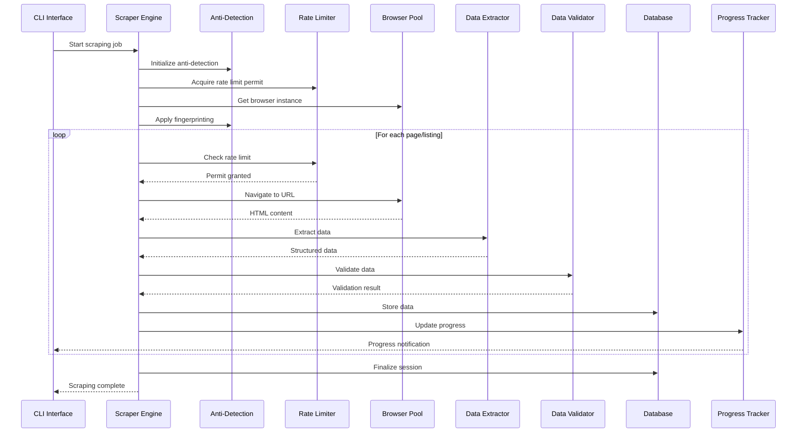
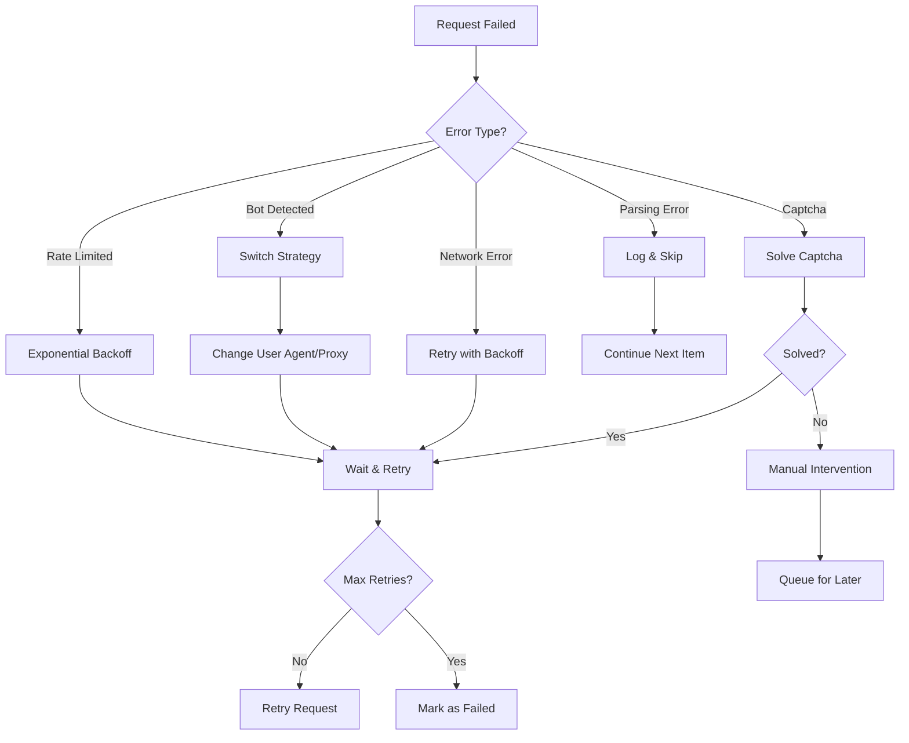
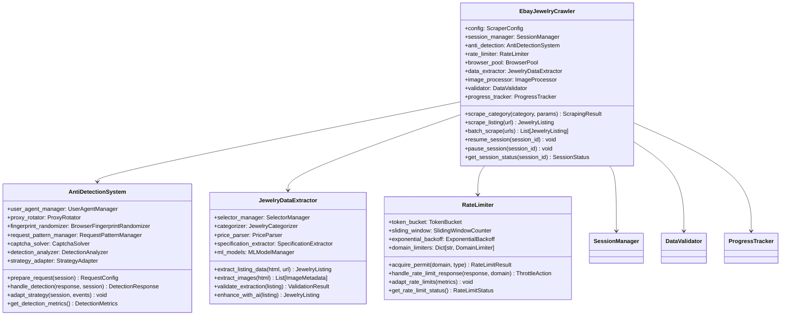
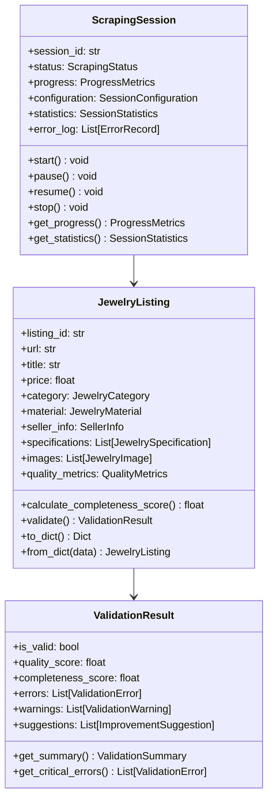

# 🏗️ eBay Jewelry Scraper - Comprehensive Architecture Design

## 📋 Table of Contents
- [Architecture Overview](#architecture-overview)
- [Core Components](#core-components)
- [Component Interactions](#component-interactions)
- [Anti-Bot Detection System](#anti-bot-detection-system)
- [Class Diagrams](#class-diagrams)
- [Key Design Decisions](#key-design-decisions)
- [Scalability Considerations](#scalability-considerations)
- [Security Architecture](#security-architecture)

## 🎯 Architecture Overview

The eBay Jewelry Scraper is designed as a modular, scalable system built on **Crawl4AI** with comprehensive anti-bot measures, intelligent data extraction, and robust error handling. The architecture follows a layered approach with clear separation of concerns.

### High-Level Architecture

```
┌─────────────────────────────────────────────────────────────────┐
│                        PRESENTATION LAYER                       │
├─────────────────┬─────────────────┬─────────────────┬───────────┤
│  CLI Interface  │   REST API      │  MCP Server     │ Dashboard │
│  (jewelry_cli)  │  (FastAPI)      │  (AI Tools)     │(Streamlit)│
└─────────────────┴─────────────────┴─────────────────┴───────────┘
                                │
┌─────────────────────────────────────────────────────────────────┐
│                       ORCHESTRATION LAYER                      │
├─────────────────┬─────────────────┬─────────────────┬───────────┤
│ Scraper Engine  │ Task Manager    │ Session Manager │ Scheduler │
│ (Coordinator)   │ (Job Queue)     │ (State Mgmt)    │ (Cron)    │
└─────────────────┴─────────────────┴─────────────────┴───────────┘
                                │
┌─────────────────────────────────────────────────────────────────┐
│                       PROCESSING LAYER                         │
├─────────────────┬─────────────────┬─────────────────┬───────────┤
│ Anti-Detection  │ Content Extract │ Data Validation │ Image Proc│
│ System          │ Pipeline        │ Engine          │ Pipeline  │
└─────────────────┴─────────────────┴─────────────────┴───────────┘
                                │
┌─────────────────────────────────────────────────────────────────┐
│                         CORE LAYER                             │
├─────────────────┬─────────────────┬─────────────────┬───────────┤
│ Crawl4AI Engine│ Browser Pool    │ Rate Limiter    │ Proxy Mgr │
│ (HTTP/Browser)  │ Management      │ & Throttling    │ Rotation  │
└─────────────────┴─────────────────┴─────────────────┴───────────┘
                                │
┌─────────────────────────────────────────────────────────────────┐
│                         DATA LAYER                             │
├─────────────────┬─────────────────┬─────────────────┬───────────┤
│ SQLite Database │ File Storage    │ Cache Layer     │ Monitoring│
│ (Listings/Meta) │ (Images/Logs)   │ (Redis/Memory)  │ Metrics   │
└─────────────────┴─────────────────┴─────────────────┴───────────┘
```

## 🧩 Core Components

### 1. **EbayJewelryCrawler** - Main Scraper Engine

The central orchestrator that coordinates all scraping activities with comprehensive anti-bot measures.

```python
class EbayJewelryCrawler:
    """
    Main eBay jewelry scraping engine with anti-detection and intelligent extraction
    """
    
    def __init__(self, config: ScraperConfig):
        # Core components
        self.config = config
        self.session_manager = SessionManager()
        self.anti_detection = AntiDetectionSystem(config.anti_detection)
        self.rate_limiter = RateLimiter(config.rate_limiting)
        self.browser_pool = BrowserPool(config.browser_pool)
        self.data_extractor = JewelryDataExtractor()
        self.image_processor = ImageProcessor()  # Existing component
        self.validator = DataValidator()
        self.progress_tracker = ProgressTracker()
        
        # Storage
        self.database = DatabaseManager(config.database)
        self.cache = CacheManager(config.cache)
        
        # Monitoring
        self.metrics_collector = MetricsCollector()
        self.logger = setup_logger("jewelry_crawler")
    
    async def scrape_category(self, category: JewelryCategory, 
                            search_params: SearchParameters) -> ScrapingResult:
        """Main scraping method with comprehensive error handling"""
        
    async def scrape_listing(self, listing_url: str) -> Optional[JewelryListing]:
        """Scrape individual jewelry listing with validation"""
        
    async def batch_scrape(self, urls: List[str]) -> List[JewelryListing]:
        """Batch scraping with concurrency control"""
```

### 2. **AntiDetectionSystem** - Sophisticated Bot Prevention

A comprehensive system to avoid detection with multiple strategies and adaptive behavior.

```python
class AntiDetectionSystem:
    """
    Multi-layered anti-detection system with adaptive strategies
    """
    
    def __init__(self, config: AntiDetectionConfig):
        self.user_agent_manager = UserAgentManager()
        self.proxy_rotator = ProxyRotator(config.proxies)
        self.fingerprint_randomizer = BrowserFingerprintRandomizer()
        self.request_pattern_manager = RequestPatternManager()
        self.captcha_solver = CaptchaSolver(config.captcha)
        
        # Adaptive behavior
        self.detection_analyzer = DetectionAnalyzer()
        self.strategy_adapter = StrategyAdapter()
        
        # Metrics and monitoring
        self.success_tracker = SuccessRateTracker()
        self.blockage_detector = BlockageDetector()
    
    async def prepare_request(self, session: ScrapingSession) -> RequestConfig:
        """Prepare request with anti-detection measures"""
        
    async def handle_detection(self, response: Response, 
                             session: ScrapingSession) -> DetectionResponse:
        """Handle potential bot detection"""
        
    async def adapt_strategy(self, session: ScrapingSession, 
                           detection_events: List[DetectionEvent]):
        """Adapt anti-detection strategy based on detection patterns"""
```

### 3. **JewelryDataExtractor** - Intelligent Content Extraction

Specialized extraction pipeline for jewelry-specific data with validation and quality assessment.

```python
class JewelryDataExtractor:
    """
    Intelligent jewelry-specific data extraction with AI-powered categorization
    """
    
    def __init__(self, config: ExtractionConfig):
        self.selector_manager = SelectorManager()
        self.categorizer = JewelryCategorizer()  # AI-powered categorization
        self.price_parser = PriceParser()
        self.specification_extractor = SpecificationExtractor()
        self.condition_parser = ConditionParser()
        self.seller_info_extractor = SellerInfoExtractor()
        
        # Quality assessment
        self.completeness_analyzer = CompletenessAnalyzer()
        self.data_quality_checker = DataQualityChecker()
        
        # Machine learning models
        self.ml_models = MLModelManager()
    
    async def extract_listing_data(self, html_content: str, 
                                 url: str) -> JewelryListing:
        """Extract comprehensive jewelry listing data"""
        
    async def extract_images(self, html_content: str) -> List[ImageMetadata]:
        """Extract and classify jewelry images"""
        
    async def validate_extraction(self, listing: JewelryListing) -> ValidationResult:
        """Validate extracted data quality and completeness"""
```

### 4. **RateLimiter & RequestThrottling** - Advanced Traffic Control

Intelligent request management with adaptive throttling and backoff strategies.

```python
class RateLimiter:
    """
    Advanced rate limiting with adaptive throttling and backoff strategies
    """
    
    def __init__(self, config: RateLimitingConfig):
        self.base_delay = config.base_delay
        self.max_delay = config.max_delay
        self.burst_limit = config.burst_limit
        self.adaptive_mode = config.adaptive_mode
        
        # Rate limiting algorithms
        self.token_bucket = TokenBucket(config.tokens_per_second)
        self.sliding_window = SlidingWindowCounter(config.window_size)
        self.exponential_backoff = ExponentialBackoff(config.backoff_params)
        
        # Adaptive behavior
        self.performance_monitor = PerformanceMonitor()
        self.congestion_detector = CongestionDetector()
        
        # Per-domain limiting
        self.domain_limiters: Dict[str, DomainLimiter] = {}
    
    async def acquire_permit(self, domain: str, 
                           request_type: RequestType) -> RateLimitResult:
        """Acquire permission to make request with dynamic delay"""
        
    async def handle_rate_limit_response(self, response: Response, 
                                       domain: str) -> ThrottleAction:
        """Handle rate limiting responses and adapt strategy"""
        
    def adapt_rate_limits(self, performance_metrics: PerformanceMetrics):
        """Dynamically adjust rate limits based on performance"""
```

### 5. **SessionManager** - State Management & Recovery

Comprehensive session management with state persistence and recovery capabilities.

```python
class SessionManager:
    """
    Session management with state persistence and recovery
    """
    
    def __init__(self, config: SessionConfig):
        self.session_store = SessionStore(config.storage)
        self.state_persister = StatePersister()
        self.recovery_manager = RecoveryManager()
        self.checkpoint_manager = CheckpointManager()
        
        # Active session tracking
        self.active_sessions: Dict[str, ScrapingSession] = {}
        self.session_metrics: Dict[str, SessionMetrics] = {}
    
    async def create_session(self, session_config: SessionConfiguration) -> ScrapingSession:
        """Create new scraping session with configuration"""
        
    async def save_session_state(self, session: ScrapingSession):
        """Save session state for recovery"""
        
    async def recover_session(self, session_id: str) -> Optional[ScrapingSession]:
        """Recover interrupted session from saved state"""
        
    async def cleanup_session(self, session_id: str):
        """Clean up completed or failed session"""
```

### 6. **DataValidator** - Quality Assurance System

Comprehensive data validation with quality metrics and automated correction.

```python
class DataValidator:
    """
    Comprehensive data validation and quality assurance system
    """
    
    def __init__(self, config: ValidationConfig):
        self.validation_rules = ValidationRuleEngine(config.rules)
        self.quality_metrics = QualityMetricsCalculator()
        self.data_cleaner = DataCleaner()
        self.anomaly_detector = AnomalyDetector()
        
        # ML-based validation
        self.ml_validator = MLDataValidator()
        self.pattern_matcher = PatternMatcher()
        
        # Reference data
        self.reference_data = ReferenceDataManager()
    
    async def validate_listing(self, listing: JewelryListing) -> ValidationResult:
        """Comprehensive listing validation with quality scores"""
        
    async def validate_batch(self, listings: List[JewelryListing]) -> BatchValidationResult:
        """Batch validation with cross-listing consistency checks"""
        
    async def suggest_corrections(self, listing: JewelryListing, 
                                validation_result: ValidationResult) -> List[Correction]:
        """Suggest automated corrections for validation failures"""
```

### 7. **ProgressTracker** - Real-time Monitoring

Real-time progress tracking with detailed metrics and notifications.

```python
class ProgressTracker:
    """
    Real-time progress tracking and monitoring system
    """
    
    def __init__(self, config: MonitoringConfig):
        self.metrics_collector = MetricsCollector()
        self.event_publisher = EventPublisher(config.events)
        self.progress_calculator = ProgressCalculator()
        self.notification_manager = NotificationManager(config.notifications)
        
        # Real-time dashboard
        self.dashboard_updater = DashboardUpdater()
        self.websocket_broadcaster = WebSocketBroadcaster()
        
        # Historical tracking
        self.metrics_store = MetricsStore(config.storage)
    
    async def track_session_progress(self, session: ScrapingSession):
        """Track and report session progress in real-time"""
        
    async def publish_milestone(self, milestone: ProgressMilestone):
        """Publish progress milestone events"""
        
    async def generate_progress_report(self, session_id: str) -> ProgressReport:
        """Generate comprehensive progress report"""
```

## 🔄 Component Interactions

### Scraping Flow Diagram



### Error Handling Flow



## 🛡️ Anti-Bot Detection System

### Multi-Layered Defense Strategy

```python
class AntiDetectionConfig:
    """Configuration for anti-detection system"""
    
    # User Agent Management
    user_agents: List[str] = [
        "Mozilla/5.0 (Windows NT 10.0; Win64; x64) AppleWebKit/537.36",
        "Mozilla/5.0 (Macintosh; Intel Mac OS X 10_15_7) AppleWebKit/537.36",
        "Mozilla/5.0 (X11; Linux x86_64) AppleWebKit/537.36"
    ]
    user_agent_rotation_frequency: int = 50  # Change every N requests
    
    # Browser Fingerprinting
    randomize_viewport: bool = True
    randomize_timezone: bool = True
    randomize_language: bool = True
    randomize_platform: bool = True
    
    # Request Patterns
    min_delay_between_requests: float = 1.0
    max_delay_between_requests: float = 5.0
    randomize_request_order: bool = True
    simulate_human_behavior: bool = True
    
    # Proxy Configuration
    proxy_rotation_enabled: bool = True
    proxy_rotation_frequency: int = 25  # Change every N requests
    proxy_health_check_interval: int = 300  # seconds
    
    # Advanced Strategies
    javascript_execution_delay: Tuple[float, float] = (0.5, 2.0)
    scroll_simulation: bool = True
    mouse_movement_simulation: bool = True
    random_page_interactions: bool = True
    
    # Detection Response
    captcha_solving_enabled: bool = True
    automatic_cooldown_on_detection: bool = True
    cooldown_duration: int = 1800  # 30 minutes
    
    # Adaptive Behavior
    success_rate_threshold: float = 0.85
    adaptation_trigger_count: int = 5
    strategy_change_cooldown: int = 600  # 10 minutes
```

### User Agent Rotation Strategy

```python
class UserAgentManager:
    """Intelligent user agent management with rotation and validation"""
    
    def __init__(self, config: UserAgentConfig):
        self.agents = self._load_user_agents(config.agents_file)
        self.success_rates = defaultdict(float)
        self.usage_counts = defaultdict(int)
        self.blocked_agents = set()
        
        # Weighted selection based on success rates
        self.agent_selector = WeightedSelector()
        
    async def get_user_agent(self, session: ScrapingSession) -> str:
        """Get optimized user agent based on success rates"""
        
        # Filter out blocked agents
        available_agents = [
            agent for agent in self.agents 
            if agent not in self.blocked_agents
        ]
        
        # Select based on weighted success rates
        if self.success_rates:
            weights = [self.success_rates[agent] for agent in available_agents]
            selected = self.agent_selector.select(available_agents, weights)
        else:
            selected = random.choice(available_agents)
            
        self.usage_counts[selected] += 1
        return selected
        
    async def report_success(self, user_agent: str, success: bool):
        """Update success rates for adaptive selection"""
        current_rate = self.success_rates[user_agent]
        usage_count = self.usage_counts[user_agent]
        
        # Exponential moving average
        alpha = 2.0 / (usage_count + 1)
        new_rate = alpha * (1.0 if success else 0.0) + (1 - alpha) * current_rate
        self.success_rates[user_agent] = new_rate
        
        # Block consistently failing agents
        if usage_count > 10 and new_rate < 0.3:
            self.blocked_agents.add(user_agent)
            self.logger.warning(f"Blocked user agent due to low success rate: {user_agent}")
```

### Proxy Rotation System

```python
class ProxyRotator:
    """Advanced proxy rotation with health monitoring and failover"""
    
    def __init__(self, config: ProxyConfig):
        self.proxies = self._load_proxies(config.proxy_list)
        self.proxy_health = defaultdict(ProxyHealthMetrics)
        self.current_proxy_index = 0
        self.failed_proxies = set()
        
        # Health monitoring
        self.health_checker = ProxyHealthChecker()
        self.failover_manager = ProxyFailoverManager()
        
    async def get_proxy(self, session: ScrapingSession) -> Optional[ProxyConfig]:
        """Get healthy proxy with automatic failover"""
        
        attempts = 0
        max_attempts = len(self.proxies)
        
        while attempts < max_attempts:
            proxy = self.proxies[self.current_proxy_index]
            
            if proxy.address not in self.failed_proxies:
                # Check proxy health
                if await self.health_checker.is_healthy(proxy):
                    self._rotate_index()
                    return proxy
                else:
                    self.failed_proxies.add(proxy.address)
                    await self._handle_failed_proxy(proxy)
            
            self._rotate_index()
            attempts += 1
            
        # All proxies failed - trigger emergency protocols
        await self._handle_proxy_exhaustion()
        return None
        
    async def _handle_failed_proxy(self, proxy: ProxyConfig):
        """Handle proxy failure with recovery attempts"""
        self.logger.warning(f"Proxy failed health check: {proxy.address}")
        
        # Schedule proxy recovery check
        asyncio.create_task(
            self.failover_manager.schedule_recovery_check(proxy, delay=300)
        )
        
    async def _handle_proxy_exhaustion(self):
        """Handle scenario when all proxies are unavailable"""
        self.logger.critical("All proxies exhausted - implementing emergency protocols")
        
        # Clear failed proxies for retry
        self.failed_proxies.clear()
        
        # Implement extended delay
        await asyncio.sleep(600)  # 10 minute cooldown
```

## 📊 Class Diagrams

### Core Scraper Classes



### Data Models and Storage



## 🔑 Key Design Decisions

### 1. **Modular Architecture**
- **Decision**: Separate concerns into distinct, loosely-coupled components
- **Rationale**: Enables independent testing, scaling, and maintenance
- **Trade-offs**: Slightly increased complexity vs. better maintainability

### 2. **Async/Await Throughout**
- **Decision**: Full async implementation for all I/O operations
- **Rationale**: Maximizes concurrency and performance for web scraping
- **Trade-offs**: More complex error handling vs. better performance

### 3. **Multi-Layered Anti-Detection**
- **Decision**: Comprehensive anti-bot system with adaptive behavior
- **Rationale**: eBay has sophisticated bot detection requiring advanced countermeasures
- **Trade-offs**: Increased complexity vs. better success rates

### 4. **Database-First Approach**
- **Decision**: SQLite with comprehensive schema and indexing
- **Rationale**: Structured data storage with ACID guarantees and fast queries
- **Trade-offs**: Storage overhead vs. data integrity and query performance

### 5. **Configuration-Driven Design**
- **Decision**: Extensive configuration options with environment overrides
- **Rationale**: Flexibility for different deployment scenarios and tuning
- **Trade-offs**: Configuration complexity vs. deployment flexibility

### 6. **Progressive Enhancement**
- **Decision**: Start with basic extraction, enhance with AI/ML
- **Rationale**: Ensures core functionality works, with optional advanced features
- **Trade-offs**: Phased development vs. immediate full feature set

## 📈 Scalability Considerations

### Horizontal Scaling
- **Session Partitioning**: Distribute scraping sessions across multiple instances
- **Database Sharding**: Partition data by category or time period
- **Load Balancing**: Distribute requests across multiple scrapers
- **Message Queues**: Use Redis/RabbitMQ for job distribution

### Performance Optimization
- **Connection Pooling**: Reuse HTTP connections and browser instances
- **Intelligent Caching**: Cache page content and extracted data
- **Batch Processing**: Group related operations for efficiency
- **Resource Management**: Monitor and limit memory/CPU usage

### Monitoring and Observability
- **Metrics Collection**: Track success rates, performance, and errors
- **Health Checks**: Monitor component health and dependencies
- **Alerting**: Notify on failures, rate limit issues, or performance degradation
- **Distributed Tracing**: Track requests across system components

## 🔒 Security Architecture

### Data Protection
- **Encryption at Rest**: Encrypt sensitive data in database
- **API Authentication**: JWT tokens for API access
- **Rate Limiting**: Prevent abuse of APIs and resources
- **Input Validation**: Sanitize all inputs to prevent injection attacks

### Privacy and Compliance
- **Data Minimization**: Collect only necessary data
- **Retention Policies**: Automatic cleanup of old data
- **Anonymization**: Remove or hash personally identifiable information
- **Audit Logging**: Track all data access and modifications

### Infrastructure Security
- **Container Security**: Minimal Docker images with security scanning
- **Network Isolation**: Separate internal and external networks
- **Secrets Management**: Secure storage and rotation of credentials
- **Regular Updates**: Automated security patches and dependency updates

---

This architecture provides a comprehensive, scalable, and maintainable foundation for eBay jewelry scraping with sophisticated anti-bot measures and intelligent data processing capabilities.