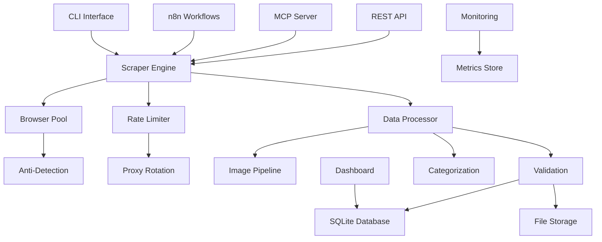

# 🔍💎 eBay Jewelry Scraping System

<div align="center">


**An intelligent, scalable eBay jewelry scraping system built on Crawl4AI with MCP integration for AI-powered data extraction.**

[Features](#-features) • [Quick Start](#-quick-start) • [Documentation](#-documentation) • [API Reference](#-api-reference) • [Architecture](#-architecture)

</div>

## 🎯 Overview

The eBay Jewelry Scraping System is a comprehensive, production-ready solution for extracting jewelry listing data from eBay. Built on top of the powerful Crawl4AI framework, it provides intelligent scraping with anti-bot measures, automated categorization, image processing, and seamless integration with AI tools through the Model Context Protocol (MCP).

### 🎉 What Makes This Special

- **🤖 AI-First Design**: Built with MCP integration for seamless AI tool connectivity
- **⚡ Lightning Fast**: Leverages Crawl4AI's 6x performance improvements
- **🛡️ Anti-Detection**: Advanced browser fingerprinting and rotation techniques
- **📊 Smart Processing**: Automatic jewelry categorization and data validation
- **🔄 Workflow Automation**: n8n integration for scheduled and event-driven scraping
- **🐳 Cloud Ready**: Docker-first architecture with scalable deployment options
- **📈 Monitoring**: Built-in health checks, metrics, and alerting

## ✨ Features

### 🕷️ **Intelligent Scraping Engine**
- **Advanced CSS Selectors**: eBay-specific selectors optimized for jewelry listings
- **Dynamic Content Handling**: JavaScript execution for SPA content
- **Rate Limiting**: Intelligent request throttling with backoff strategies
- **Error Recovery**: Robust retry mechanisms and failure handling
- **Browser Pooling**: Pre-warmed browser instances for optimal performance

### 💎 **Jewelry-Specific Processing**
- **Smart Categorization**: Automatic classification (rings, necklaces, bracelets, etc.)
- **Image Pipeline**: Concurrent download, optimization, and metadata extraction
- **Data Validation**: Comprehensive quality checks and completeness validation
- **Price Tracking**: Historical price data and trend analysis
- **Condition Assessment**: Automated condition parsing and standardization

### 🔌 **MCP Integration**
- **Tool Endpoints**: Direct integration with Claude Code and other MCP clients
- **Resource Access**: Real-time data querying and export capabilities
- **Prompt Templates**: Pre-built templates for common jewelry analysis tasks
- **Event Streaming**: Real-time scraping status and result notifications

### 🔄 **Workflow Automation**
- **n8n Integration**: Visual workflow builder for complex automation
- **Scheduled Scraping**: Cron-based and interval scheduling
- **Error Handling**: Automated recovery and notification workflows
- **Data Export**: Multi-format export with cloud storage integration
- **Monitoring**: Health checks and performance alerting

### 🏗️ **Enterprise Features**
- **Docker Deployment**: Production-ready containerization
- **Database Management**: SQLite with backup and migration support
- **CLI Interface**: Comprehensive command-line tools
- **REST API**: Full HTTP API with OpenAPI documentation
- **Dashboard**: Real-time monitoring and control interface

## 🚀 Quick Start

### Prerequisites
- Docker 20.10+ and Docker Compose
- Python 3.10+ (for development)
- 4GB+ RAM (8GB+ recommended)
- Git for repository cloning

### 1. Clone and Setup

```bash
# Clone the repository
git clone https://github.com/your-org/ebay-jewelry-scraper.git
cd ebay-jewelry-scraper

# Copy environment template
cp .env.example .env

# Edit configuration (add your API keys, database settings, etc.)
nano .env
```

### 2. Launch with Docker Compose

```bash
# Start all services (scraper, MCP server, n8n, database)
docker-compose up -d

# Check service status
docker-compose ps

# View logs
docker-compose logs -f scraper
```

### 3. Verify Installation

```bash
# Health check
curl http://localhost:11235/health

# MCP server status
curl http://localhost:11235/mcp/schema

# n8n workflow interface
open http://localhost:5678

# Monitoring dashboard
open http://localhost:8501
```

### 4. First Scrape

```bash
# Using CLI
./jewelry-scraper scrape --category rings --max-pages 5

# Using Python SDK
python -c "
from jewelry_scraper import JewelryScraper
scraper = JewelryScraper()
results = scraper.scrape_category('rings', max_listings=100)
print(f'Scraped {len(results)} ring listings')
"

# Using MCP (with Claude Code)
claude mcp add --transport sse jewelry-scraper http://localhost:11235/mcp/sse
```

## 📚 Documentation

| Document | Description |
|----------|-------------|
| [**API Reference**](docs/api-reference.md) | Complete MCP and REST API documentation |
| [**Usage Guide**](docs/usage-guide.md) | Detailed usage examples and workflows |
| [**Configuration**](docs/configuration.md) | System configuration and customization |
| [**Deployment Guide**](docs/deployment.md) | Production deployment instructions |
| [**Architecture**](docs/architecture.md) | System design and technical details |
| [**Troubleshooting**](docs/troubleshooting.md) | Common issues and solutions |
| [**Development Guide**](docs/development.md) | Contributing and extending the system |
| [**Security Guide**](docs/security.md) | Security best practices and compliance |
| [**Performance Tuning**](docs/performance.md) | Optimization and scaling guide |

## 🎯 Use Cases

### 🔍 **Market Research**
```bash
# Analyze pricing trends for diamond rings
./jewelry-scraper analyze --category "diamond rings" --days 30 --export trends.csv

# Compare prices across different sellers
./jewelry-scraper compare --search "vintage necklace" --min-price 100 --max-price 1000
```

### 🤖 **AI Integration**
```python
# Using with Claude Code via MCP
from mcp_client import JewelryMCP

client = JewelryMCP("http://localhost:11235")
results = await client.scrape_jewelry({
    "category": "engagement rings",
    "budget_range": [1000, 5000],
    "analysis": "Find best value options with certification"
})
```

### 📊 **Automated Workflows**
- **Daily Price Monitoring**: Track specific items for price changes
- **New Listing Alerts**: Get notified of new items matching criteria
- **Inventory Management**: Monitor seller inventory and availability
- **Competitive Analysis**: Track competitor pricing and strategies

## 🏗️ Architecture



### Core Components

- **Scraper Engine**: Crawl4AI-powered scraping with eBay-specific optimizations
- **MCP Server**: Model Context Protocol integration for AI tools
- **Image Pipeline**: Concurrent image processing and optimization
- **Data Layer**: SQLite database with automated backups
- **Workflow Engine**: n8n-based automation and scheduling
- **Monitoring**: Health checks, metrics, and alerting system

## 🔧 Configuration

### Environment Variables

```bash
# eBay Settings
EBAY_BASE_URL=https://www.ebay.com
EBAY_CATEGORIES=jewelry,watches,fashion
EBAY_RATE_LIMIT=2.0

# Database
DATABASE_URL=sqlite:///data/jewelry.db
BACKUP_SCHEDULE=0 2 * * *

# Image Processing
IMAGE_STORAGE_PATH=/data/images
IMAGE_MAX_SIZE=1920x1080
IMAGE_QUALITY=85

# MCP Server
MCP_HOST=0.0.0.0
MCP_PORT=11235
MCP_ENABLE_TOOLS=true

# n8n Integration
N8N_HOST=localhost
N8N_PORT=5678
N8N_WEBHOOK_PATH=/webhook/jewelry

# Monitoring
METRICS_ENABLED=true
DASHBOARD_PORT=8501
ALERT_WEBHOOK_URL=https://hooks.slack.com/your-webhook
```

### Advanced Configuration

See [Configuration Guide](docs/configuration.md) for detailed settings including:
- Browser configuration and fingerprinting
- Proxy rotation and IP management  
- Anti-detection strategies
- Custom extraction selectors
- Data validation rules
- Export formats and destinations

## 🛠️ Development

### Local Development Setup

```bash
# Create virtual environment
python -m venv venv
source venv/bin/activate  # or `venv\Scripts\activate` on Windows

# Install dependencies
pip install -r requirements-dev.txt

# Install pre-commit hooks
pre-commit install

# Run tests
pytest tests/ -v

# Start development server
python -m jewelry_scraper.server --dev
```

### Testing

```bash
# Run all tests
pytest

# Run specific test categories
pytest tests/unit/
pytest tests/integration/
pytest tests/e2e/

# Run with coverage
pytest --cov=jewelry_scraper --cov-report=html

# Performance tests
pytest tests/performance/ -v --benchmark-only
```

## 🚢 Deployment

### Docker Compose (Recommended)

```yaml
version: '3.8'
services:
  scraper:
    image: jewelry-scraper:latest
    ports:
      - "11235:11235"
    environment:
      - DATABASE_URL=sqlite:///data/jewelry.db
    volumes:
      - ./data:/data
      - ./config:/config
    
  n8n:
    image: n8nio/n8n:latest
    ports:
      - "5678:5678"
    volumes:
      - ./n8n-data:/home/node/.n8n
    
  dashboard:
    image: jewelry-scraper-dashboard:latest
    ports:
      - "8501:8501"
    depends_on:
      - scraper
```

### Kubernetes

```bash
# Apply Kubernetes manifests
kubectl apply -f k8s/

# Check deployment status
kubectl get pods -n jewelry-scraper

# Access dashboard
kubectl port-forward svc/dashboard 8501:8501
```

### Cloud Platforms

- **AWS**: ECS/Fargate with RDS and S3 integration
- **Google Cloud**: Cloud Run with Cloud SQL and Cloud Storage
- **Azure**: Container Instances with Azure Database and Blob Storage

## 📊 Monitoring & Observability

### Health Checks
- Application health endpoint: `/health`
- Database connectivity check
- Browser pool status monitoring  
- External API availability

### Metrics
- Scraping success rates and performance
- Data quality metrics and validation failures
- Resource utilization (CPU, memory, disk)
- Request rates and response times

### Alerting
- Failed scraping jobs
- Data quality threshold violations
- System resource exhaustion
- External service failures

## 🔒 Security

### Data Protection
- Secure API token management
- Encrypted data storage options
- GDPR compliance features
- Data retention policies

### Access Control
- JWT authentication for APIs
- Role-based access control
- API rate limiting
- Audit logging

### Anti-Detection
- Browser fingerprint randomization
- User-agent rotation
- Proxy chain support
- Request timing variation

## 🚀 Performance

### Optimization Features
- Browser instance pooling
- Concurrent image processing
- Database query optimization
- Intelligent caching strategies

### Scaling Options
- Horizontal scraper scaling
- Load balancing configuration
- Database sharding support
- CDN integration for images

## 🤝 Contributing

We welcome contributions! Please see our [Development Guide](docs/development.md) for details on:

- Code style and standards
- Testing requirements
- Pull request process
- Issue reporting guidelines

### Quick Contribution Setup

```bash
# Fork and clone the repository
git clone https://github.com/your-username/ebay-jewelry-scraper.git

# Create feature branch
git checkout -b feature/your-feature-name

# Make changes and test
pytest tests/

# Submit pull request
git push origin feature/your-feature-name
```

## 📄 License

This project is licensed under the Apache License 2.0 - see the [LICENSE](LICENSE) file for details.

## 🆘 Support

- 📖 [Documentation](docs/)
- 🐛 [Issue Tracker](https://github.com/your-org/ebay-jewelry-scraper/issues)
- 💬 [Discord Community](https://discord.gg/your-invite)
- 📧 [Email Support](mailto:support@your-org.com)

## 🎉 Acknowledgments

Built on top of the amazing [Crawl4AI](https://github.com/unclecode/crawl4ai) framework. Special thanks to:

- The Crawl4AI community for the robust foundation
- n8n for workflow automation capabilities
- The MCP protocol team for AI integration standards
- All contributors and users of this project

---

<div align="center">

**Ready to start scraping jewelry data intelligently?**

[Get Started](#-quick-start) • [View Documentation](docs/) • [Join Community](https://discord.gg/your-invite)

Made with ❤️ for the data science and e-commerce communities

</div>